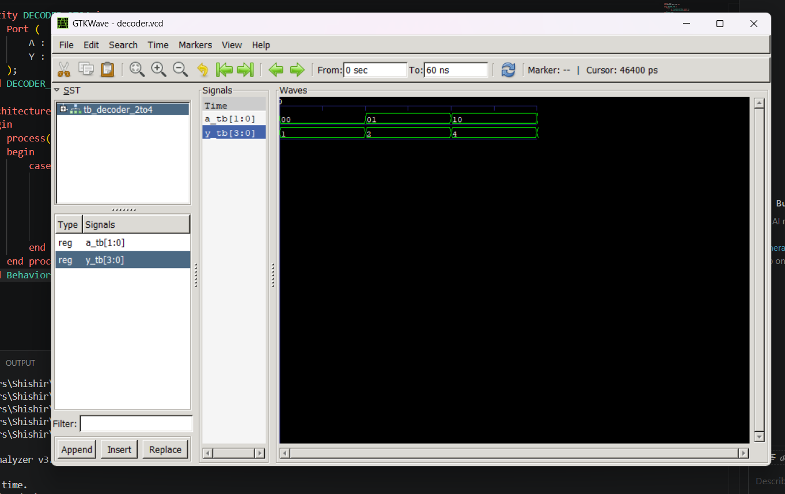
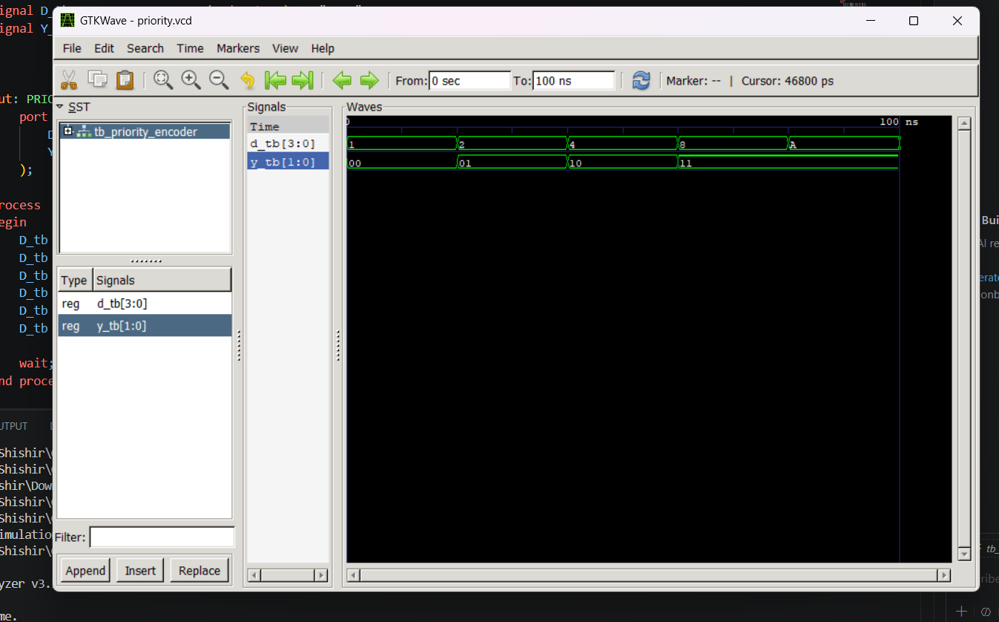

# Lab 3: VHDL Implementation of Combinational Circuits (Priority Encoder and Decoder)

## Objective

* To design and simulate a 4-to-2 Priority Encoder using VHDL.
* To design and simulate a 2-to-4 Decoder using VHDL.

---

## Theory

### 4-to-2 Priority Encoder

A priority encoder is a combinational logic circuit that converts multiple input lines into a smaller number of output lines. Unlike a simple encoder, a priority encoder assigns priority to the highest-order active input when more than one input is HIGH.

A 4-to-2 priority encoder has four inputs (I0, I1, I2, I3) and two outputs (Y1, Y0). Input I3 has the highest priority and I0 has the lowest priority.

### Truth Table (4-to-2 Priority Encoder)

| I3 | I2 | I1 | I0 | Y1 | Y0 |
| -- | -- | -- | -- | -- | -- |
| 0  | 0  | 0  | 1  | 0  | 0  |
| 0  | 0  | 1  | X  | 0  | 1  |
| 0  | 1  | X  | X  | 1  | 0  |
| 1  | X  | X  | X  | 1  | 1  |

---

### 2-to-4 Decoder

A decoder is a combinational circuit that converts binary information from n input lines to a maximum of 2ⁿ unique output lines.

A 2-to-4 decoder consists of two inputs (A1, A0) and four outputs (Y0, Y1, Y2, Y3). Depending on the binary input combination, only one output becomes active at a time.

### Truth Table (2-to-4 Decoder)

| A1 | A0 | Y3 | Y2 | Y1 | Y0 |
| -- | -- | -- | -- | -- | -- |
| 0  | 0  | 0  | 0  | 0  | 1  |
| 0  | 1  | 0  | 0  | 1  | 0  |
| 1  | 0  | 0  | 1  | 0  | 0  |
| 1  | 1  | 1  | 0  | 0  | 0  |

---

## Output

### 2-to-4 Decoder Simulation Output

    

---

### 4-to-2 Priority Encoder Simulation Output

    

---

## Discussion

In this laboratory experiment, two important combinational logic circuits were designed and simulated using VHDL: a 4-to-2 priority encoder and a 2-to-4 decoder.

The priority encoder successfully generated the correct binary output according to the highest-priority active input. The decoder correctly converted the binary input combination into a single active output line.

The simulation results obtained from GTKWave verified the expected behavior of both circuits. The encoder properly handled input priorities, while the decoder activated the corresponding output line for each input combination.

---

## Conclusion

This experiment provided practical knowledge of designing and simulating combinational circuits using VHDL.

### We successfully:

* Designed a 4-to-2 Priority Encoder.
* Designed a 2-to-4 Decoder.
* Simulated both circuits using GTKWave.
* Verified the correctness of the output waveforms.

The experiment strengthened the understanding of combinational logic design and VHDL-based digital circuit implementation.
