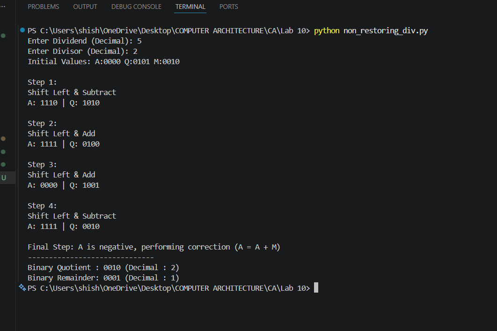

# Lab 10: Implementation of Non-Restoring Division Algorithm Using Python

## Objective

The objectives of this lab are:

- To understand the working principle of the Non-Restoring Division Algorithm.
- To implement the Non-Restoring Division Algorithm using Python.
- To perform binary division using addition and subtraction operations.
- To simulate the step-by-step execution of the division process.
- To verify the quotient and remainder in both binary and decimal form.

---

# Theory

The Non-Restoring Division Algorithm is a binary division method used in computer architecture for dividing signed or unsigned binary numbers. Unlike the restoring division algorithm, it does not restore the accumulator immediately after an unsuccessful subtraction. Instead, it decides whether to add or subtract the divisor during the next iteration based on the sign of the accumulator.

This algorithm improves efficiency by reducing the number of operations required during division and is commonly used in digital processors and arithmetic logic units (ALUs).

The algorithm uses three registers:

- **A (Accumulator)** – Stores the partial remainder.
- **Q (Dividend/Quotient Register)** – Initially contains the dividend and finally stores the quotient.
- **M (Divisor Register)** – Stores the divisor.

Initially, the accumulator is set to zero, and the dividend is loaded into the quotient register.

---

## Non-Restoring Division Operations

| Condition of A | Operation |
|----------------|-----------|
| A ≥ 0 | Shift Left, then A = A − M |
| A < 0 | Shift Left, then A = A + M |
| Resulting A ≥ 0 | Set Q₀ = 1 |
| Resulting A < 0 | Set Q₀ = 0 |
| Final A < 0 | Perform A = A + M (Correction Step) |

---

# Algorithm Steps

1. Read the dividend and divisor.
2. Convert both numbers into binary.
3. Initialize the accumulator (A) to zero.
4. Perform a left shift on the combined A and Q registers.
5. If the previous accumulator was positive, subtract the divisor.
6. If the previous accumulator was negative, add the divisor.
7. Update the least significant bit of the quotient.
8. Repeat the process for the number of bits.
9. If the accumulator is negative after the final iteration, perform a correction by adding the divisor.
10. Display the final quotient and remainder in binary and decimal.

---

# Output

# Conclusion

In this laboratory experiment, the Non-Restoring Division Algorithm was successfully implemented using Python. The program correctly performed binary division by applying shift, addition, and subtraction operations based on the sign of the accumulator. The correction step ensured that the final remainder was valid whenever the accumulator became negative after the last iteration. The simulation verified the correctness of both the quotient and remainder in binary as well as decimal form. This experiment provided practical knowledge of binary division techniques and their implementation in computer architecture.