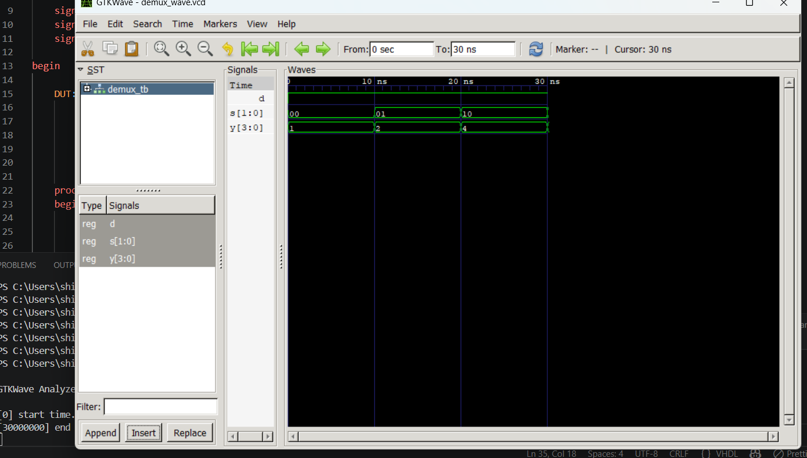
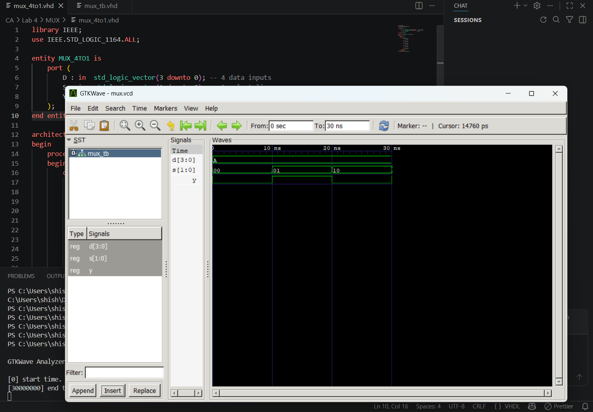

# Lab 3: VHDL Implementation of Combinational Circuits MUX and DEMUX

## Objective
*To design and simulate a 4-to-1 Multiplexer using VHDL.
*To design and simulate a 1-to-4 Demultiplexer using VHDL.
Theory
4-to-1 Multiplexer

---
## Theory

A multiplexer is a combinational circuit that selects one input from many inputs and sends it to a single output line based on select signals.

A 4-to-1 multiplexer has four inputs (D0, D1, D2, D3), two select lines (S1, S0), and one output (Y). The select lines decide which input is passed to the output.

## Truth Table (4-to-1 MUX)
S1	S0	Y
0	0	D0
0	1	D1
1	0	D2
1	1	D3
1-to-4 Demultiplexer

A demultiplexer is a combinational circuit that takes one input and sends it to one of many outputs based on select signals.

A 1-to-4 demultiplexer has one input (D), two select lines (S1, S0), and four outputs (Y0, Y1, Y2, Y3). Only one output is active at a time.

## Truth Table (1-to-4 DEMUX)
S1	S0	Y3	Y2	Y1	Y0
0	0	0	0	0	D
0	1	0	0	D	0
1	0	0	D	0	0
1	1	D	0	0	0
Output
4-to-1 Multiplexer Simulation Output:

    

1-to-4 Demultiplexer Simulation Output

    

## Discussion

In this experiment, we designed and simulated a 4-to-1 multiplexer and a 1-to-4 demultiplexer using VHDL.

The multiplexer correctly selected one input out of four based on select lines and sent it to the output. The demultiplexer correctly routed the single input to one of the four outputs depending on the select lines.

The simulation results from GTKWave matched the expected truth tables and confirmed correct operation of both circuits.

## Conclusion

In this lab, we successfully designed and tested both MUX and DEMUX using VHDL.

We achieved:
Design of a 4-to-1 Multiplexer
Design of a 1-to-4 Demultiplexer
Simulation using GHDL and GTKWave
Verification using waveform output

# This experiment helped us understand how data is selected and distributed in digital systems using combinational logic.