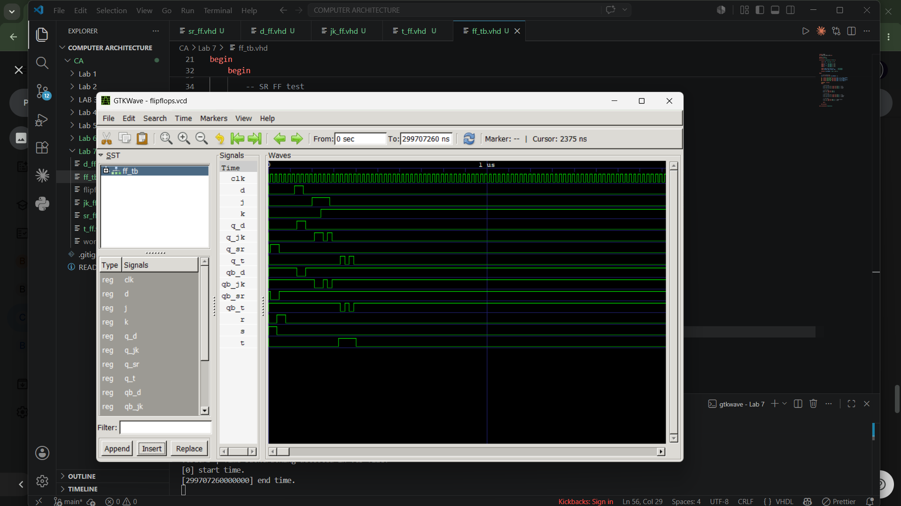

# Lab 7: Implementation and Simulation of Flip-Flops Using VHDL

## Objective

The objectives of this lab are:

- To understand the working principle of sequential logic circuits.
- To design and implement SR, D, JK, and T Flip-Flops using VHDL.
- To simulate the behavior of each flip-flop using a common testbench.
- To verify the output waveforms and compare them with the expected truth tables.

---

# Theory

A **Flip-Flop** is a sequential digital circuit capable of storing one bit of binary data. Unlike combinational circuits, flip-flops have memory and their outputs depend on both the current inputs and the previous state. They are edge-triggered devices that change state only on the active edge of the clock signal.

### 1. SR Flip-Flop

The SR (Set-Reset) Flip-Flop has two inputs:
- **S (Set)**
- **R (Reset)**

It performs set, reset, and hold operations depending on the input combination. The condition where both S and R are high simultaneously is considered invalid.

---

### 2. D Flip-Flop

The D (Data) Flip-Flop has a single input **D**. On every rising edge of the clock, the output simply follows the value of D.

It eliminates the invalid state present in the SR Flip-Flop and is widely used in registers and memory circuits.

---

### 3. JK Flip-Flop

The JK Flip-Flop is an improved version of the SR Flip-Flop. It removes the invalid condition by introducing a toggle operation when both inputs are high.

Operations include:
- Hold
- Reset
- Set
- Toggle

---

### 4. T Flip-Flop

The T (Toggle) Flip-Flop has a single input **T**.

- When **T = 0**, the output remains unchanged.
- When **T = 1**, the output toggles on every rising clock edge.

It is commonly used in binary counters and frequency dividers.

---

# Truth Tables

## SR Flip-Flop

| S | R | Next Q |
|---|---|--------|
| 0 | 0 | Hold |
| 0 | 1 | 0 |
| 1 | 0 | 1 |
| 1 | 1 | Invalid |

---

## D Flip-Flop

| D | Next Q |
|---|--------|
| 0 | 0 |
| 1 | 1 |

---

## JK Flip-Flop

| J | K | Next Q |
|---|---|--------|
| 0 | 0 | Hold |
| 0 | 1 | 0 |
| 1 | 0 | 1 |
| 1 | 1 | Toggle |

---

## T Flip-Flop

| T | Next Q |
|---|--------|
| 0 | Hold |
| 1 | Toggle |

---

# Files Included

- `SR_FF.vhd` – SR Flip-Flop implementation
- `D_FF.vhd` – D Flip-Flop implementation
- `JK_FF.vhd` – JK Flip-Flop implementation
- `T_FF.vhd` – T Flip-Flop implementation
- `FF_TB.vhd` – Testbench for simulation

---

# Simulation Output

> (image.png)

---

---

# Conclusion

In this laboratory experiment, SR, D, JK, and T Flip-Flops were successfully implemented using VHDL and verified through simulation. The observed waveforms matched the expected behavior described by their respective truth tables. The experiment demonstrated how sequential circuits store and update data based on clock edges and highlighted the differences between various types of flip-flops. This lab provided practical experience in designing, simulating, and analyzing sequential logic circuits using VHDL.