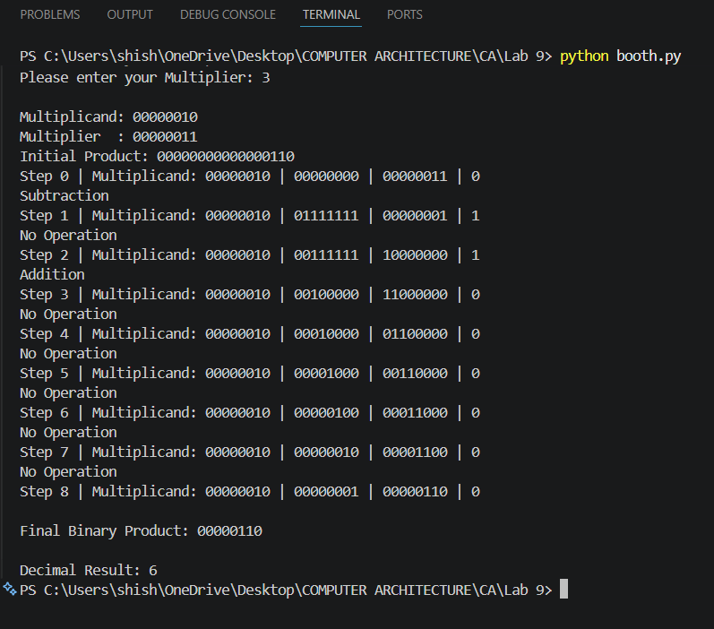

# Lab 9: Implementation of Booth's Multiplication Algorithm Using Python

## Objective

The objectives of this lab are:

* To understand the working principle of Booth's Multiplication Algorithm.
* To implement Booth's Algorithm using Python.
* To perform signed binary multiplication using 2's complement representation.
* To simulate the step-by-step execution of Booth's Algorithm.
* To verify the multiplication result in both binary and decimal form.

---

# Theory

Booth's Algorithm is an efficient multiplication algorithm used for multiplying signed binary numbers represented in **2's complement form**. It minimizes the number of addition and subtraction operations by examining two consecutive bits of the multiplier during each iteration.

The algorithm is widely used in computer architecture because it efficiently handles both positive and negative numbers while reducing hardware complexity.

For an **n-bit multiplication**, the algorithm maintains three registers:

* **A (Accumulator)** – Stores intermediate results.
* **Q (Multiplier)** – Contains the multiplier.
* **Q-1** – An additional bit used to determine the operation.
* **M (Multiplicand)** – The number to be multiplied.

During each iteration, the last bit of **Q** and **Q-1** are examined to determine the required operation.

---

## Booth's Algorithm Operations

| Q₀ Q₋₁ | Operation                              |
| ------ | -------------------------------------- |
| 00     | No Operation (Arithmetic Right Shift)  |
| 01     | Add Multiplicand to Accumulator        |
| 10     | Subtract Multiplicand from Accumulator |
| 11     | No Operation (Arithmetic Right Shift)  |

After performing the required operation, an **Arithmetic Right Shift** is executed. This process is repeated for the number of bits in the multiplier.

---

# Algorithm Steps

1. Read the multiplicand and multiplier.
2. Convert both numbers into 8-bit binary (2's complement if negative).
3. Initialize the product register with zeros, multiplier, and Q-1 = 0.
4. Check the last two bits (Q₀ and Q₋₁).
5. Perform one of the following:

   * No operation
   * Addition
   * Subtraction
6. Perform an arithmetic right shift.
7. Repeat the process for 8 iterations.
8. Display the final binary product.
9. Display the decimal multiplication result.

---

# OutPut

---

# Conclusion

In this laboratory experiment, Booth's Multiplication Algorithm was successfully implemented using Python. The program correctly performed signed binary multiplication by applying addition, subtraction, and arithmetic right shift operations according to Booth's Algorithm. The implementation supported both positive and negative numbers through 2's complement representation. The step-by-step execution demonstrated the internal working of the algorithm, while the final binary and decimal outputs verified the correctness of the multiplication process. This experiment provided practical understanding of binary arithmetic and multiplication techniques used in computer architecture.
